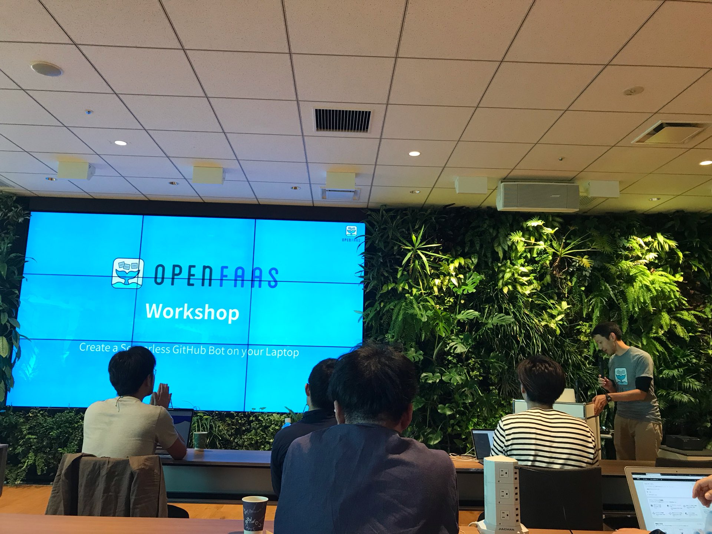
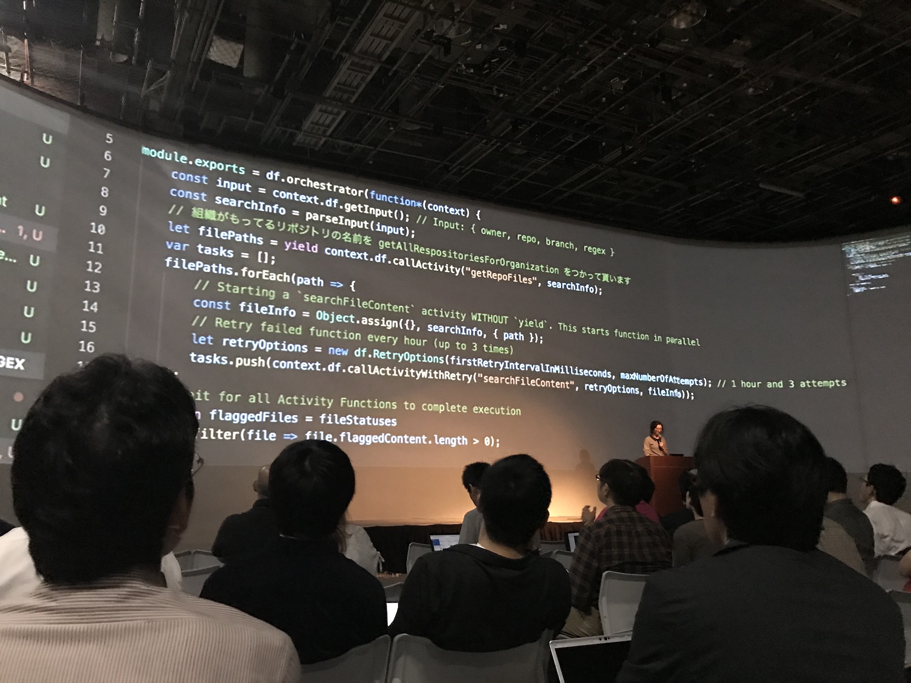
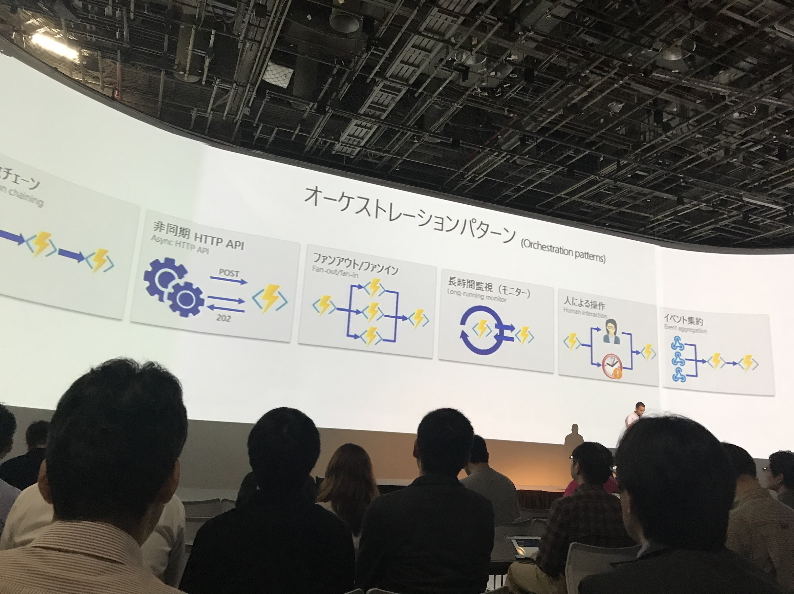
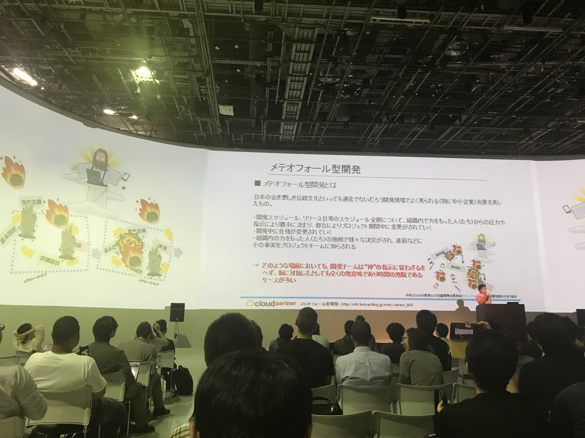
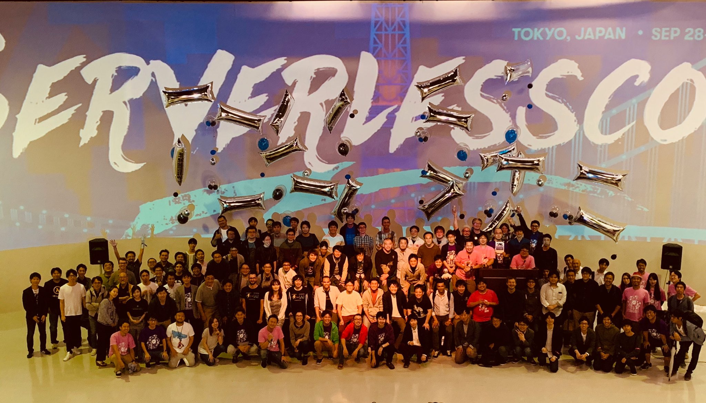

# Serverlessconf Tokyo 2018
2018/09/28-29

A GitPitch-style report

---

About Serverlessconf Tokyo2018
- サーバーレスに関する最新情報が集まるカンファレンス. AWS Summit や JAWS Day に比べ、クラウドベンダーにとらわれない
- [Serverlessconf](http://serverlessconf.io/) 自体の開催地は US, London, Paris など。
- [東京開催](http://tokyo.serverlessconf.io/)。今回で日本開催は3回目。

---

### 3 Days event
- Day 1. workshop (100名+)
- Day 2. conference (300名+)
- Day 3. contribution day -> 台風影響で延期

---

Day 1. Workshop 2018/09/28

---

- コースA: (AWS) Serverelss Tech Challenge
- コースB: Azure Serverless Workshop
- コースC: __OpenFaaS x Serverless Framework__

---

OpenFaaS
- AWS Lambda の Docker 上で動く OSS 版という感じ
- 自分の環境に Docker Swarm と OpenFaaS をインストールし、10個のステージ (Lab) を自分でクリアしていき、 OpenFaaS がどんな事ができるのかを体験学習する
  - 講義スライド -> [speakerdeck](https://speakerdeck.com/kenfdev/openfaas-workshop-20180928)
  - 実習内容 -> [github](https://github.com/kenfdev/workshop/blob/ja/translations/ja/lab3.md)

+++

感想
- openfaasのメリット
  - 関数の土台を全部自分で管理できる
  - Dockerなので、ローカルで作ってそのまま production で動かせる
- デメリット
  - 全部自分で見るので、大規模にやるのは辛いよ、コストかかる
  - 商用事例まだ少ない (2017年初頭〜). 国内0
- 個人的には... docker の勉強になるのと、 FaaS の一般的な学習にはなる

---

Serverelss Framework
- 固有名詞です (Node.js 製ツール)
  - クラウドのサービス群を quick deploy するためのツール
  - ルール配信機能をAWSに商用デプロイするのに利用中
  - Azure 等ほかクラウドベンダーも対応しているが、限定的

+++

workshop 内容 -> [github](https://github.com/horike37/serverless-plugin-workshop)
- ~~serverless frameworkを使った設定・デプロイの仕方~~
- serverless framework の プラグインの開発方法！
- DynamoDBのデータを一括ダウンロードできるコマンドの作成
- deploy コマンド実行時についでに監視 (X-Ray) を on/off する機能の実装

+++

感想
- 正直、使ってないとだいぶハードル高い
- しかし実践で早速役立ちそうだった (DB登録情報の一括取得)
- 細かい工夫ポイントなどに発見があったり、自分の観点があっているとわかって嬉しかったり (regionをオプション指定できる工夫とか)

---

Day 2. 2018/09/29 conference

---

リンク集
- [Agenda](http://tokyo.serverlessconf.io/agenda.html)
- [【Serverlessconf Tokyo 2018】カンファレンス資料まとめ](https://qiita.com/hayao_k/items/6410648d9942cc7003e9)

---

Azure 頑張ってる
- Azure Function 2.0 や Azure Durable Function すごい。もしかすると AWS の Lambda や StepFunctions より良いかも
  - Docker 上でも動く = オンプレ, IoT 端末上でも動く
  - オーケストレーションが凄くシンプルに書ける

+++

---

監視系の話題が多い
- サーバーレスは開発が早いが運用監視が複雑化しがち (マイクロサービス化)
- 監視のポイントも変わる
  - 従来のCPU, mem, disk監視から, 同時実行数上限, スロットリング発生, 実行時間, HTTP status code等の監視へ
- AWS Lambda 使うなら X-Ray 使っておけ (今すぐ入れようか)
- DataDog: マルチクラウドの統合監視 の使い勝手の良さ

---

その他
- CI/CDのツールと工夫, データの持ち方
- 日本企業にありがちな [メテオフォール型開発 に サーバーレス開発 は相性が良い！？](https://www.slideshare.net/ssuser084061/x-117338837)
 
+++

---

### 総評
- 有料だが少額. 実際手を動かしながら最前線の人たちから襲われる貴重な機会
- クラウド上の開発以外にも、システムアーキテクチャの考え方としてとても参考になる (「それ、サーバーレスでやる必要ある？」と問いながら)

+++

- カンファレンスとしては若い
  - みんなが割りと対等に話せるし, ここで集まる情報はかなり鮮度が良さそう
  - 48:9 スクリーンすごい, 雰囲気チャラかっこいい
  - social ほしい, ネットワーク環境悪い, 手書き受付 (何かトラブル？)

---

